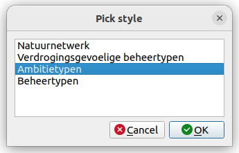

# WFS Styler

QGIS plugin for setting a WMS style to a WFS layer.

If an OGC service is hosting data both as WMS and WFS layers, this plugin 
tries to find the corresponding WMS for a WFS, picks up the WMS styles
(SLD's) and sets the style to the WFS.

## How to

Selecting a WFS layer in the layer panel will enable the plugin button 
. When clicking the button, the plugin will try to 
**guess** the URL to the WMS service and try to find any styles hosted there.

If one or more styles are found, the plugin will show a dialog with the
style name(s) to the user. 

The user can pick a style and the plugin will apply that style to the active layer.

## Limitations

* The plugin will download the SLD file and load it on the layer. There are (many)
known issues between QGIS and SLD styling due to the differences in data formats.
* The plugin has only been tested on GeoServer and MapServer.
* The plugin will need to guess the WMS url based on the WFS url. However, those can
manually configured in different ways. For example, if the layer names are different
for WMS and WFS, there's no chance the plugin will figure out the right WMS url.

## Licence

This software is licenced under the [EUPL](LICENSE).

## Province of Zeeland

The functional idea for this plugin came from the Province of Zeeland, The Netherlands. They also financially contributed to the development.